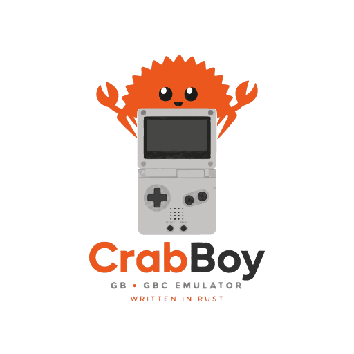

<p align="center"></p>

# CrabBoy

A multi-system emulator in Rust. It hosts a **Game Boy / Game Boy Color**
core and a **Game Boy Advance** core behind one platform-agnostic interface,
with desktop, command-line and WebAssembly frontends. The goal is
hardware-accurate emulation of all three systems in pure Rust.

```
crates/
  emu-core/        Platform-agnostic traits & types (System, Frame, Audio, Button)
  gb-core/         Game Boy / Game Boy Color core, no GUI/OS/wasm deps
  gba-core/        Game Boy Advance core, no GUI/OS/wasm deps
  crab-systems/    Detects the console from a ROM header and builds the core;
                   the only crate frontends depend on
platforms/
  desktop/         egui desktop app ("CrabBoy")
  cli/             `crab` headless runner plus developer tools
                   (accuracy, fetch_test_roms, gba-diag, gba-disasm, ...)
  wasm/            wasm-bindgen bindings and the browser demo (web/)
docs/
  gba/             Verified hardware notes (boot, BIOS, DMA, I/O, RTC) and the
                   pinned verification runs
  releasing.md     How a release is cut
assets/            Logo and the generated icons (see assets/README.md)
```

See [`ROADMAP.md`](ROADMAP.md) for the milestones, [`CHANGELOG.md`](CHANGELOG.md)
for what each release contains and [`docs/accuracy.md`](docs/accuracy.md) for
the current test-suite results.

A low-level **Nintendo 3DS** core is in development on the `3ds` branch
(`crates/ctr-core` and friends, behind the `crab-systems/ctr` feature). It
loads FIRM payloads but does not emulate the processors yet, and it will need
files dumped from your own console for anything beyond homebrew; see
[`docs/3ds/overview.md`](docs/3ds/overview.md).

## Status

| | Game Boy | Game Boy Color | Game Boy Advance |
|---|---|---|---|
| Desktop | yes | yes | yes |
| `crab` CLI | yes | yes | yes |
| Browser (wasm) | yes | yes | yes |
| Boots commercial games | yes | yes | yes (HLE BIOS, or a user-supplied `gba_bios.bin`) |
| Playable | yes (Pokémon Red) | yes (Pokémon Crystal) | Pokémon Emerald/Ruby intro, title and menus render and play with sound |
| Save types | MBC1/2/3/5 battery RAM, MBC3 RTC | same | SRAM, Flash 64K/128K, EEPROM 512 B/8 KB, cartridge RTC |
| Save states | yes | yes | yes |
| Audio | four channels | four channels | four channels + DirectSound FIFOs |

The GBA core passes the jsmolka arm, thumb, memory, bios and save test
suites and reaches the Pokémon Emerald and Ruby title screens and menus
(`docs/gba/verification.md` lists the pinned frames). Known gaps: cartridge
prefetch and precise wait states, the OBJ cycle budget, mosaic corner cases.

The Game Boy CPU is stepped per M-cycle: blargg's cpu_instrs, instr_timing,
mem_timing, mem_timing-2 and halt_bug pass, as does every mooneye acceptance
test outside `ppu/` (OAM DMA, timer, serial and interrupt timing included).
`docs/accuracy.md` records the full suite results.

Emulation is integer-only and deterministic: CI checks that x86_64, aarch64
and wasm builds produce bit-identical frames.

## Download

Each release on the [Releases page](https://github.com/SmartyDroidBot/CrabBoy/releases)
ships:

| Platform | Archive |
|---|---|
| Linux x86_64 | `crabboy-<version>-linux-amd64.tar.gz` |
| Linux arm64 | `crabboy-<version>-linux-arm64.tar.gz` |
| Windows x86_64 | `crabboy-<version>-windows-amd64.zip` |
| Windows arm64 | `crabboy-<version>-windows-arm64.zip` |
| Browser | `crabboy-<version>-web.zip` (serve the folder over HTTP) |

Archives contain the `CrabBoy` desktop app and the `crab` command-line
runner. The browser demo of the latest release is also deployed to GitHub
Pages. No ROMs or BIOS images are included or ever will be.

## Building

Rust 1.88 or newer. On Linux the desktop app needs the ALSA headers and
`pkg-config` (`sudo apt install libasound2-dev pkg-config`).

```sh
# Desktop
cargo run --release -p crab-desktop -- path/to/game.gba
cargo run --release -p crab-desktop -- --bios gba_bios.bin path/to/game.gba

# Headless
cargo run --release -p crab-cli --bin crab -- info path/to/game.gb
cargo run --release -p crab-cli --bin crab -- run path/to/game.gb \
    --frames 600 --input START@400 --dump frame.png --wav out.wav --hash

# Browser: see platforms/wasm/web/README.md
cargo build -p crab-wasm --release --target wasm32-unknown-unknown
wasm-bindgen --target web --out-dir platforms/wasm/web/pkg \
    target/wasm32-unknown-unknown/release/crab_wasm.wasm

# Everything CI runs
cargo build --workspace --all-targets
cargo test --workspace
cargo clippy --workspace --all-targets -- -D warnings
cargo fmt --all -- --check
```

The console is detected from the ROM header, not the file extension. A GBA
ROM boots through high-level BIOS emulation unless a 16 KB `gba_bios.bin`
is passed with `--bios` or found next to the ROM or the executable.

`cargo run --release -p crab-cli --bin fetch_test_roms` downloads the
open-source accuracy suites (c-sp game-boy-test-roms, jsmolka gba-tests)
into `roms/test-suites/`, which is gitignored.

## Controls

| Key | Action |
|---|---|
| Arrows | D-pad |
| Z / X | A / B |
| Enter / Backspace | Start / Select |
| A / S | L / R (GBA) |
| P / R / F | Pause / Reset / Fast-forward |
| F1–F4, Shift+F1–F4 | Save / load state slots |
| F5 / F9 | Quick save / quick load |

The browser demo adds on-screen touch controls and gamepad support.

## Pure Rust

The emulator cores, `crab-systems`, the CLI runner and the wasm bindings are
pure Rust with no C code. The remaining exceptions are host bindings:

- Desktop audio on Linux links `alsa-sys` (the ALSA C library); on Windows
  it uses WASAPI through the `windows` crate. Graphics go through OpenGL
  loaded at runtime.
- `fetch_test_roms` (a developer tool, not shipped) uses `ureq` with
  `rustls`, whose `ring` backend contains C and assembly.

## Contributing

All contributors (humans and AI agents) must follow
[`guidelines.md`](guidelines.md), including the pre-commit checklist and the
EU-style commit message format. Parts of this project were written with the
help of Claude (Anthropic), which is credited here rather than in individual
commits.

## Known Issues

- **GBA timing** is approximate: no cartridge prefetch buffer, no
  sequential/non-sequential distinction, DMA does not stall the CPU.
- **Game Boy PPU** renders per scanline (no pixel FIFO yet): dmg-acid2,
  cgb-acid2, the mealybug tests and mooneye's `ppu/` timing tests fail.
- **Audio accuracy**: the Game Boy APU still mixes in floating point and
  the GBA PSG lacks the finer edge cases (sweep and length quirks); both
  are milestones on the roadmap.
- **CGB double-speed audio** is emitted at 16384 Hz (the native CGB APU rate
  when the CPU switches to double speed). Frontends resample to a fixed
  output rate and must honour `System::audio_rate()`.

## Design

- `emu_core::System` is the uniform interface every console core implements, so
  frontends can host any console behind one `Box<dyn System>`.
- `crab_systems::detect` identifies a ROM from its header bytes and
  `crab_systems::load_with` builds the matching system, so no frontend knows
  about individual cores.
- `emu_core::Device` is the uniform interface for pluggable peripherals
  (PPU, timer, APU, joypad). Devices tick with an abstract `Bus` and downcast
  via `as_any_mut()` to the concrete bus.
- `emu_core::Button` is a shared logical input set that each core maps to its
  own bitmask; cores ignore buttons they do not have.
- The emulation path is integer-only and deterministic: the same number of
  master cycles produces the same state on every platform and in WebAssembly.

## License

AGPL-3.0-or-later. See [LICENSE](LICENSE).
